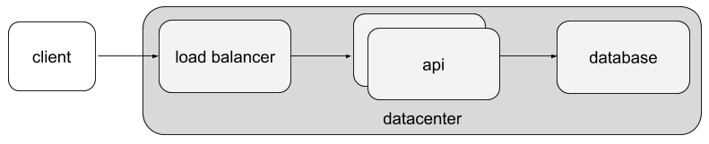
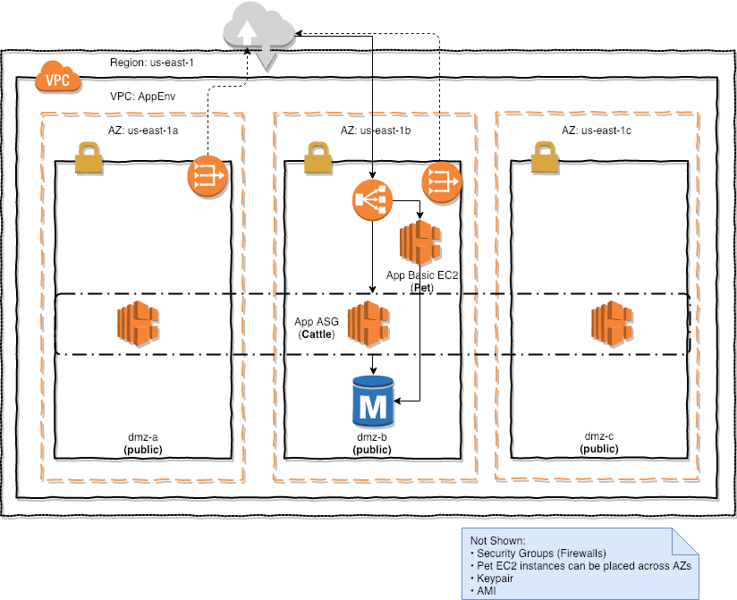

# Multi-Tier App on AWS #

This exercise will challenge you to create a 'basic' multi-tier application on AWS.



The application is a webapp that uses a Cloud-managed Postgres instance and will also require the provisioning of supporting networking and security infrastructure.

In total, the exercise will step through provisioning:

* using existing VPC and subnet network resources
* load balancer
* application instances
* an RDS Postgres database instance
* network and security groups configuration that permits:

    * ingress of http(s) traffic to the load balancer from the Internet
    * http(s) traffic from the lb to the app instances
    * ssh access to the app instances from the Internet
    * access from the application instances to the database

* credential management
    * a key pair for use with app instances
    * master and IAM credential information for the database instance

The final deployment will look like:



# Exercise #

## Getting Started: Configuring the AWS provider ##

Create a config.tf file with an AWS provider specified to use us-west-2

Export environment variables for:

* `AWS_REGION=us-west-2`
* `AWS_ACCESS_KEY_ID=<your api access key>`
* `AWS_SECRET_ACCESS_KEY=<your secret access key>`

Create an empty main.tf file.

Run:

1. `terraform init`
2. `terraform plan`

Expected Result: 
Terraform should initialize plugins and report zero resource additions, modifications, and deletions

## Define namespace and network to use for project ##

Declare variables for:

* name - your name/userid, e.g. `jsmith`
* vpc_id - the id of the VPC network to use, e.g. `vpc-58a29221`

Specify the default values in the variable declarations.

Create a terraform.tfvars file and set the value of the `name` variable in that file. 

## Resolve existing network resources ##

Use the [aws_vpc](https://www.terraform.io/docs/providers/aws/d/vpc.html) data source to resolve information about the VPC identified by `var.vpc_id`

Use the [aws_subnet_ids](https://www.terraform.io/docs/providers/aws/d/subnet_ids.html) data source to resolve the subnet ids in the VPC identified by `var.vpc_id`

Hint: default VPC id for region is available on the EC2 Dashboard and prefixed with `vpc-`, e.g. `vpc-58a29221`

## Create Firewall Rules to Permit Access ##

Create the following security groups, each name suffixed with `-${var.name}`:
 
1. public-web - a security group that permits http and https access from the public Internet (tcp ports 80 & 443) 
2. public-ssh - a security group that permits ssh access from the public Internet (tcp port 22)
3. internal-web - a security group that permits http access only from sources in the VPC (tcp port 80) 
4. outbound - a security group that permits access from the VPC to the Internet

The 'public-web' security group should end up with a name like `public-web-jsmith`.  This namespacing pattern will avoid collisions with other students' for Security Groups and other resources.  

## Create a KeyPair for use with EC2 ##

Create an AWS Key Pair using an ssh keypair.

You may use an existing ssh key.

If you do not have an ssh keypair you can generate one with: `ssh-keygen -t rsa -f exercise.id_rsa` # do not specify a passphrase

Use the `file` function in Terraform's [interpolation syntax](https://www.terraform.io/docs/configuration/interpolation.html) to read the file.
If you used an existing key, it's easiest to copy the public key into this directory or use an absolute, fully-qualified path when reading it with the `file` function.

Run `terraform plan`

Expected Result: `1 to add, 0 to change, 0 to destroy.` 

Run `terraform apply`

## Create an EC2 instance managed by an Auto Scaling Group ##

Define an Auto Scaling Group (ASG) using the [terraform-aws-modules/autoscaling/aws](https://github.com/terraform-aws-modules/terraform-aws-autoscaling) Terraform module, version `2.9.0`. 


The ASG should create and maintain one t3.medium EC2 instance using [Amazon ECS Optimized Linux](http://docs.aws.amazon.com/AmazonECS/latest/developerguide/ecs-optimized_AMI.html)
ami details:

* ami id in us-west-2: ami-01b70aea4161476b7
* name: amzn-ami-2018.03.i-amazon-ecs-optimized 

The EC2 instance should:

* reference the generated keypair to permit logins
* be launched into one of the default vpc subnets; hint: `vpc_zone_identifier = ["${data.aws_subnet_ids.default_vpc.ids}"]`
* have a public IP
* be publicly-accessible _only_ via ssh
* run the `nginx.yml.tpl` cloud-init script on startup
* be tagged with

    * `Name=exercise-<yourname>`
    * `Environment=training`
    * `WorkloadType=CuteButNamelessCow`

Run `terraform plan` and `terraform apply`

### Digging Deeper ###

Inspect Terraform state:
`head terraform.tfstate`

What format does this look like?

Find your the instance you just created and look at it in AWS EC2 console:
`grep i-.* terraform.tfstate`


## Attach Security Groups to EC2 Instance ##

Attach the public-ssh, internal-web, and outbound security groups to the ec2 instances.

Run `terraform plan` and `terraform apply`

You should now be able to login to the instance via ssh with:
`ssh -i ./exercise.id_rsa ec2-user@<public DNS>`

That command assumes you generated a new ssh keypair, if you used an existing identity, you probably just need:
`ssh ec2-user@<public DNS>`

e.g.
```
ssh -i ./exercise.id_rsa ec2-user@ec2-107-23-217-33.compute-1.amazonaws.com

   __|  __|  __|
   _|  (   \__ \   Amazon ECS-Optimized Amazon Linux AMI 2018.03.i
 ____|\___|____/

For documentation visit, http://aws.amazon.com/documentation/ecs
```

## Reconfigure backend to use remote state ##

Reconfigure Terraform's state storage backend to use s3:

```
terraform {
  backend "s3" {
    bucket     = "qm-training-cm-us-west-2"
    key        = "infra/terraform/qm-training/us-west-2/cm/exercise-<your name>.tfstate"
    region     = "us-west-2"
    encrypt    = true
    dynamodb_table = "TerraformStateLock"
  }
}
```

Run `terraform init` again to re-initialize the state storage backend.

## Create an ELB ##

Create an Elastic Load Balancer.

Connect ELB to app instance and specify a health check to / on port 80


## Output Location of ELB and App Server ##

Share the location of the ELB and App Server via a module output.

Open-up the ELB location in a web browser!

## Add a Postgres DB using RDS ##

Use the Terraform [community RDS module](https://github.com/terraform-aws-modules/terraform-aws-rds) to instantiate a small Postgres DB:

```
  engine            = "postgres"
  engine_version    = "9.6.3"
  instance_class    = "db.t2.micro"
  allocated_storage = 5
```

Navigate to the `/counter` path on the ELB.  Is it counting?

## (Optional) Refactor to Support Multiple Instances ##

Consider that we might want to have multiple instances...

Update the ASG's `desired_capacity` field 2.  Plan & Apply.


# Local Development and Testing #

Testing modules locally can be accomplished using a series of `Make` tasks
contained in this repo.

| Make Task | What happens                                                                                                  |
|:----------|:--------------------------------------------------------------------------------------------------------------|
| all       | Execute the canonical build for the generic infrastructure module (does not destroy infra)                    |
| converge  | Execute `kitchen converge` for all modules                                                                    |
| lint      | Execute `tflint` for generic infrastructure module                                                            |
| test      | Execute `kitchen test --destroy=always` for all modules                                                       |
| verify    | Execute `kitchen verify` for all modules                                                                      |
| destroy   | Execute `kitchen destroy` for all modules                                                                     |
| kitchen   | Execute `kitchen <command>`. Specify the command with the `COMMAND` argument to `make`                        |

e.g. run a single test: `make kitchen COMMAND="verify minimal-aws"`

**Typical Workflow:**

1. Start-off with a clean slate of running test infrastructure: `make destroy; make all`
2. Make changes and (repeatedly) run: `make converge && make verify`
3. Rebuild everything from scratch: `make destroy; make all`
4. Commit and issue pull request


## Running Test Kitchen for a single module

Test Kitchen uses the concept of "instances" as it's medium for multiple test 
packages in a project.
An "instance" is the combination of a _test suite_ and a _platform_.
This project uses a single _platform_ for all specs (e.g. `aws`).
The name of this platform actually doesn't matter since the terraform provisioner
and driver are not affected by it.

You can see the available test instances by running the `kitchen list` command:

```bash
$ make kitchen COMMAND=list
Instance     Driver     Provisioner  Verifier   Transport  Last Action  Last Error
default-aws  Terraform  Terraform    Terraform  Ssh        Verified
```

To run Test Kitchen processes for a single instance, you **must** use the `kitchen`
target from the make file and pass the command and the instance name using the
`COMMAND` variable to make.

```bash
# where 'default-aws is an Instance name from kitchen's list
$ make kitchen COMMAND="converge default-aws"
```